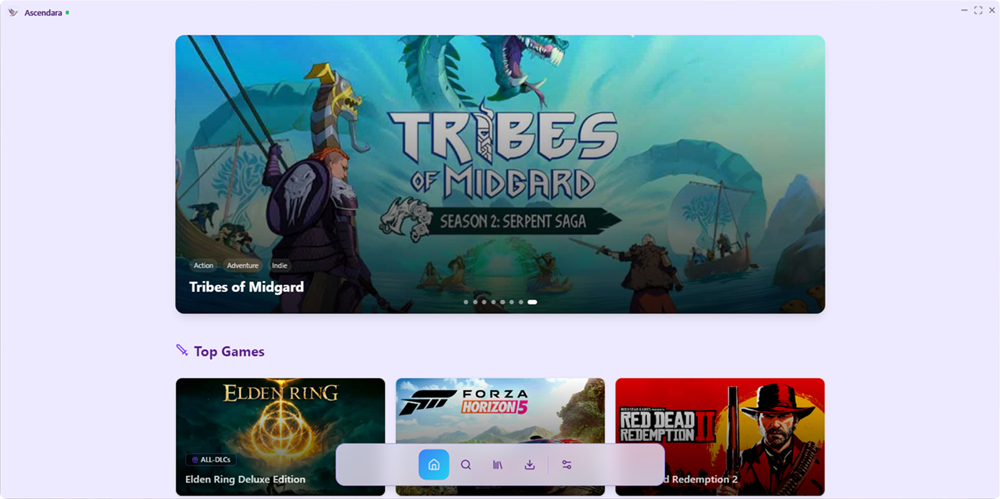
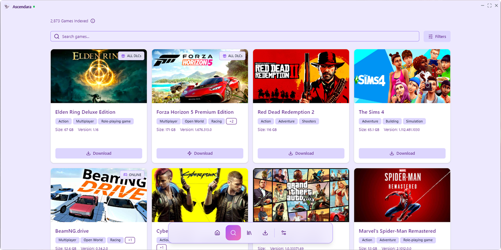
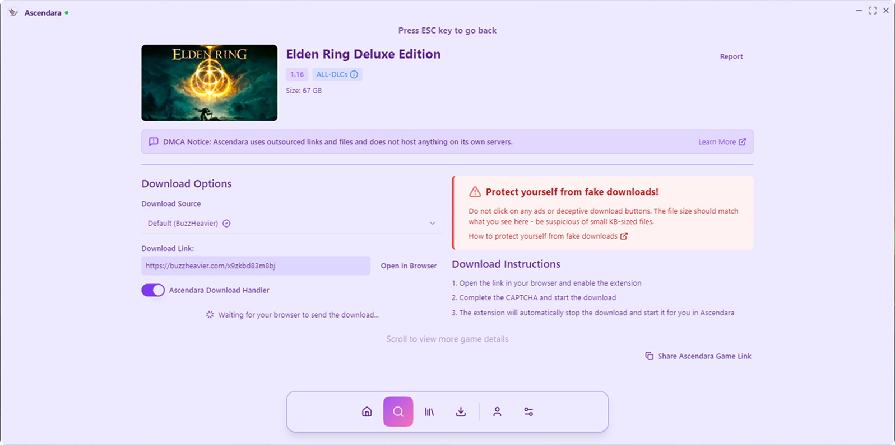
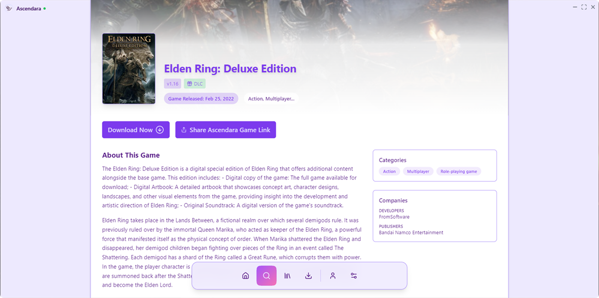
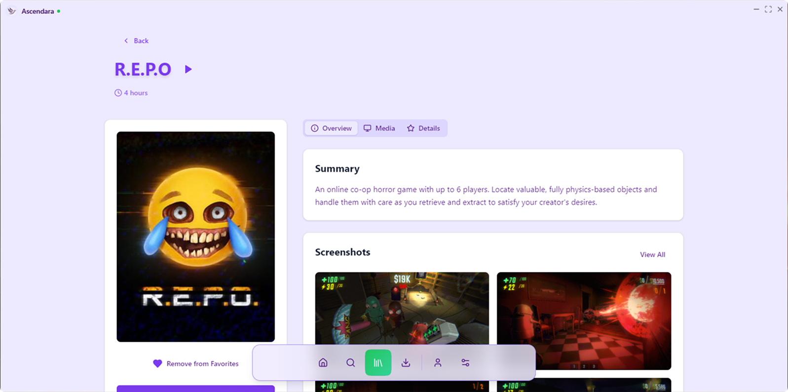
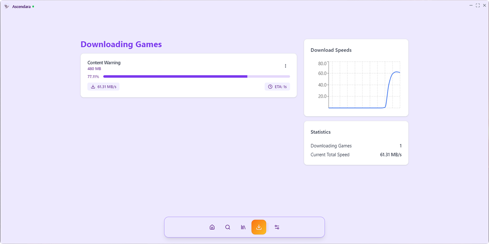
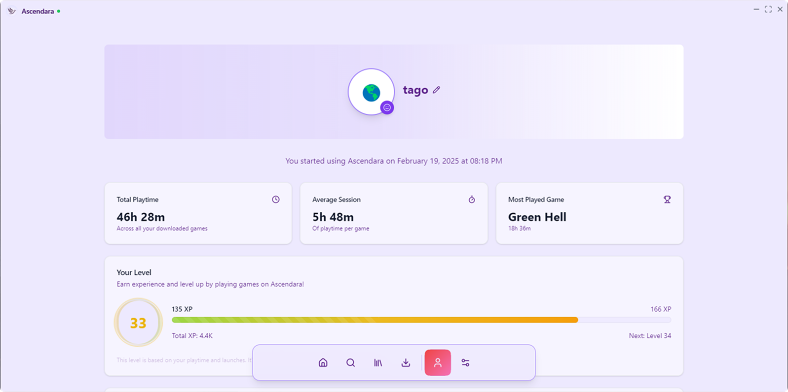

<div align="center">
    
    <h1>Ascendara</h1>
    <p><em>The best way to test games before you buy them.</em></p>
    <p>
        <a href="https://discord.gg/ap6W3xMTKW"></a>
        <a href="https://github.com/tagoWorks/ascendara/releases/latest"></a>
         
        <a href="./LICENSE"></a>
    </p>
    <p>
        <a href="https://github.com/tagoWorks/ascendara/issues"></a>
        
        
        <a href="https://github.com/tagoWorks/ascendara/network/members"></a>
        <a href="https://github.com/tagoWorks/ascendara/stargazers"></a>
    </p>
</div>

## 🎮 About

Ascendara simplifies your pirating experience by providing a seamless way to download, manage, and play the pre-installed games. No more hassle with extracting, installing, or moving files. The game library is powered by a custom webscraper, currently featuring games from [STEAMRIP](https://ascendara.app/sources/steamrip) and [FitGirl](https://ascendara.app/sources/fitgirl), with plans to expand to more sources.

### 👥 Community

- [Join the Discord](https://discord.gg/ascendara) for discussions and support
- [Submit feedback for Ascendara](https://ascendara.app/feedback)
- [Read the latest changelog](https://ascendara.app/changelog)
- [Check latest releases on Github](https://github.com/tagoWorks/ascendara/releases)

## ✨ Features

- 🚀 **Seamless Downloads**  
  Lightning-fast 2 click download for games that support it. No browser needed at all.

- 🌐 **Browser Integration**  
  Seamlessly integrate with your browser for one-click game downloads and management.

- 🎨 **Theme Customization**  
  Beautiful, appealing themes to choose from for a truly unique experience.

- 🕑 **Ascendara Timemachine**  
  Access and download previous versions of games with the Ascendara Timemachine.

- 👤 **Your own username**  
  Personalize your username for online game cracks that support it.

- 🌍 **105 Languages Support**  
 Full interface support for 105 different languages, making Ascendara accessible worldwide.
<details>
<summary>See the 12 base languages</summary>

These languages come with the app by default:

- English
- Spanish
- French
- German
- Italian
- Chinese
- Arabic
- Hindi
- Bengali
- Portuguese
- Russian
- Japanese

<details>
<summary>Want to see the full list?</summary>

- Afrikaans
- Albanian
- Amharic
- Armenian
- Azerbaijani
- Basque
- Belarusian
- Bulgarian
- Bosnian
- Catalan
- Cebuano
- Chichewa
- Chinese (Traditional)
- Corsican
- Croatian
- Czech
- Danish
- Dutch
- Esperanto
- Estonian
- Filipino
- Finnish
- Frisian
- Galician
- Georgian
- Greek
- Gujarati
- Hausa
- Hawaiian
- Hebrew
- Hmong
- Hungarian
- Icelandic
- Igbo
- Indonesian
- Irish
- Javanese
- Kannada
- Kazakh
- Khmer
- Korean
- Kurdish
- Kyrgyz
- Lao
- Latin
- Latvian
- Lithuanian
- Luxembourgish
- Macedonian
- Malagasy
- Malay
- Malayalam
- Maltese
- Maori
- Marathi
- Mongolian
- Myanmar (Burmese)
- Nepali
- Norwegian
- Pashto
- Persian
- Polish
- Punjabi
- Romanian
- Samoan
- Scottish Gaelic
- Serbian
- Sesotho
- Shona
- Sindhi
- Sinhala
- Slovak
- Slovenian
- Somali
- Sundanese
- Swedish
- Swahili
- Tajik
- Tamil
- Telugu
- Thai
- Turkish
- Ukrainian
- Urdu
- Uzbek
- Vietnamese
- Welsh
- Xhosa
- Yiddish
- Yoruba
- Zulu

</details>

</details>

## 🖼️ Preview

### Download Latest Version

🚀 [Download the Ascendara Installer](https://ascendara.app/)

<details>
<summary>📸 Screenshots</summary>

<div style="display: flex; flex-wrap: wrap; justify-content: center;">
  <div style="margin: 1%; width: 24%;">
    <h3 style="text-align: center;">Home Page</h3>
    
  </div>
  <div style="margin: 1%; width: 24%;">
    <h3 style="text-align: center;">Search Page</h3>
    
  </div>
  <div style="margin: 1%; width: 24%;">
    <h3 style="text-align: center;">Download Game</h3>
    
  </div>
  <div style="margin: 1%; width: 24%;">
    <h3 style="text-align: center;">Game Metadata</h3>
    
  </div>
  <div style="margin: 1%; width: 24%;">
    <h3 style="text-align: center;">Library</h3>
    
  </div>
  <div style="margin: 1%; width: 24%;">
    <h3 style="text-align: center;">Play Game</h3>
    
  </div>
  <div style="margin: 1%; width: 24%;">
    <h3 style="text-align: center;">Downloads</h3>
    
  </div>
  <div style="margin: 1%; width: 24%;">
    <h3 style="text-align: center;">Profile</h3>
    
  </div>
</div>

</details>

## 🤝 Contributing

Contributing to Ascendara is the best way to get your desired features, bug fixes, or improvements into the official build! When your contribution is accepted, your changes will be prominently featured in the Ascendara changelogs, giving you recognition for your valuable input to the project. Learn how to contribute to Ascendara [here](https://ascendara.app/docs/getting-started/contributing).

## 📂 Project Structure

The Ascendara project is organized into the following main directories:

- **src/**: Core application logic and UI implementation

  - **components/**: Core UI components
  - **context/**: React context providers for state management
  - **hooks/**: Custom hooks for efficient image loading and caching
  - **public/**: Static assets and public resources
  - **lib/**: Miscellaneous utility libraries and helper functions
  - **pages/**: Main application pages/screens
  - **services/**: Service modules for external API requests and core application functionality
  - **styles/**: CSS and styling files
  - **translations/**: Internationalization files

- **binaries/**: Prebuilt binaries for core application functionality

  - **AscendaraCrashReporter/**: Crash reporting functionality
  - **AscendaraDownloader/**: Game download managers to handle most files
  - **AscendaraGameHandler/**: Game execution and management
  - **AscendaraNotificationHelper/**: Download notification helper tool

    > ℹ️ INFO: The tools below are additional tools that do not come with the official build of Ascendara. Instead, they utilize Ascendara's tool installation feature to install these supplementary tools as needed.

  - **AscendaraLanguageTranslation/**: Translation tool used to translate to the additional 93 languages
  - **AscendaraTorrentHandler/**: Torrent download functionality

- **scripts/**: Helper scripts for development, deployment, and maintenance
- **electron/**: The source code for the Electron app and IPC handles
- **installer/**: Source code for the graphical installer and setup process

## 🛠️ Running from Source

For detailed instructions, check out the [Developer Docs](https://ascendara.app/docs/developer/build-from-source).

### Prerequisites

Before building, ensure you have all required dependencies. [View full requirements](https://ascendara.app/docs/developer/build-from-source#prerequisites).

### Quick Start

> ⚠️ **WARNING:** Some API features like reporting and analytics services will not work on the public version of the app. Additionally, you will not be able to run games in development mode. Check the [Developer Docs](https://ascendara.app/docs/developer/build-from-source#important-limitations) for more information.

1. **Clone the Repository**

   ```sh
   git clone https://github.com/ascendara/ascendara.git
   ```

2. **Install Node Dependencies**

> **Note:** You can use any package manager you prefer, such as npm, yarn, or pnpm.

Using npm:

```sh
npm install
```

Or using yarn:

```sh
yarn
```

3. **Install Python Dependencies**

   ```sh
   pip install -r requirements.txt
   ```

4. **Run the Development App**

   > ⚠️ **Note:** Before running, set `isDev = true` in `electron/app.js`.

   Using npm:

   ```sh
   npm run start
   ```

   Or using yarn:

   ```sh
   yarn start
   ```

To build the source code into an executable, read the [Developer Docs](https://ascendara.app/docs/developer/build-from-source).

## 🗺️ Development Roadmap

### Current Goals

- [ ] Add semi-support for Linux, and macOS with Wine and Winetricks
- [ ] Revamp game info scraping logic/API (Dynamic game indexing)
- [ ] Improved download management (pausing, resuming)

### Future Goals

> Want to suggest a feature you don't see here? [Contribute](https://ascendara.app/docs/getting-started/contributing) to Ascendara or [submit feedback](https://ascendara.app/feedback)!

- [ ] Ascendara approved additional sources
- [ ] Debrid support for downloads
- [ ] Community driven path finding tool
- [ ] Cloud data support
- [ ] Endpoint for known games that have weird installation paths, issues, etc.
- [ ] Break up code into files for better Organizations
- [ ] Retry Download & Extract functionality

### Completed Features

- [x] Complete UI overhaul (V7)
- [x] Legacy game version support (Ascendara Timemachine)
- [x] Enhanced antivirus operation checks (File Verification)
- [x] Game updating logic to be able to save time played and other metrics while updating the game
- [x] Game ratings and reliability system
- [x] Import games from Steam into library
- [x] Steam workshop downloading page
- [x] FitGirl and torrenting support
- [x] Notification handling for desktop
- [x] Automatic shortcut creation
- [x] Enhanced search algorithms
- [x] Theme customization
- [x] Game dependencies reinstallation option
- [x] Advanced filtering options
- [x] Comprehensive tooltips
- [x] Page population
- [x] Welcome screens
- [x] Improved tab navigation
- [x] Separate library, downloads, and browse sections
- [x] Custom game addition support
- [x] Public API creation
- [x] Popularity-based sorting

## 📝 License & Contact

Licensed under [CC BY-NC 1.0 Universal](./LICENSE) - 2025 tagoWorks

### Get in Touch

- Email: [santiago@tago.works](mailto:santiago@tago.works)
- Website: [tago.works](https://tago.works)
- Discord: [Join our community](https://ascendara.app/discord)

---

<div align="center">
    <sub>Built with 💖 by <a href="https://tago.works">tago</a></sub>
</div>
